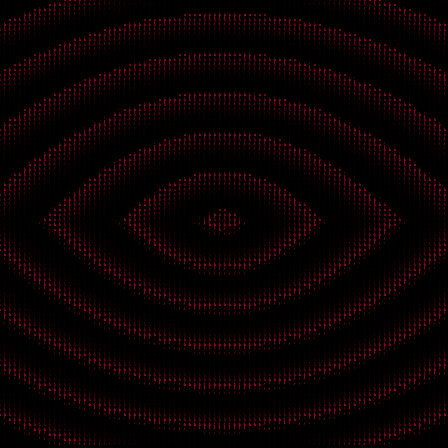

## ASCII Converter
Quick and simple ASCII filter for images and GIFs, made with the Processing Framework.
Feel free to use anything in this repository as you wish!
   

 

 
  
---
### How To Use
1. Open the sketch in the [Processing IDE](https://processing.org/download). 
2. Make sure you have the **gifAnimation** library installed.  
To install the gifAnimation library, within the Processing IDE, go to:  
&nbsp;&nbsp;&nbsp;&nbsp;&nbsp;&nbsp;&nbsp;&nbsp;&nbsp;&nbsp;&nbsp;&nbsp;*Sketch* -> *Import Library...* -> *Manage Libraries...*  
 Find **gifAnimation** and click on *install*.  
3. Drag and drop the files you wish to convert directly onto the Processing IDE window, or add them to the sketch's *\data* folder.
4. Near the top of the sketch's code, change *glsl.gif* to the name of the file to be converted.
5. Press *Run*!

> This sketch can also be run as a standard Java project by using the Processing library. 

---
### Optional features
Feel free to play around with the code in any way, shape or form! Here are just a few notes on the directly implemented extra features.
In the sketch's global variables, you will find a section with *params to play around with*. These parameters have little descriptions and are easy enough to understand,
but just in case: 
- To turn on the wave-like effect, set the ***wave*** variable to true. Change the amplitude and frequency of the wave with the ***wavePower*** and ***waveSpeed*** variables.
- ***str*** is the string of characters used by the ASCII effect. It is ordered by luminance, from darkest to brightest.
- At the end of the sketch, within the *drawASCII* function, there are two commented out lines of code. These lines draw a pretty filter based on dots. Rectangles, dots or even custom shapes
  could be used in similar fashion. The ***l*** variable is used to add size variance based on luminance. Using it in different places can result in some cool effects!

---
### Dependencies
In order to handle GIFs, this Processing sketch uses the [gifAnimation Library for Processing](https://github.com/extrapixel/gif-animation) by extrapixel (Patrick Meister), 
ported to Processing 3 by Jérôme Saint-Clair. All credit for this library go to Patrick, Jérôme and the rest of the contributors.

---
### License 
This repository is licensed under a **Creative Commons Zero Universal v1 (CC0 1.0)** license, so once again, feel free to do with this code as you please. Enjoy!
